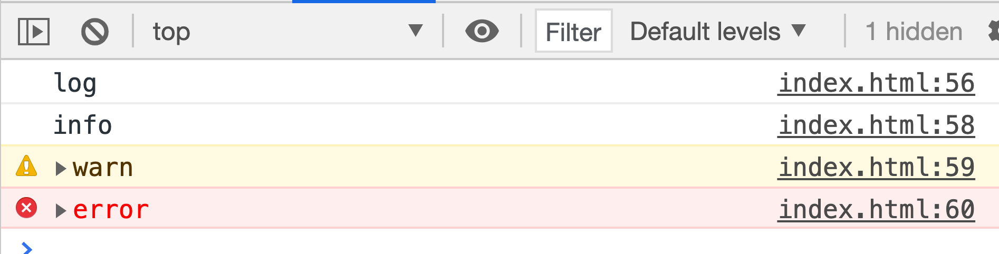

# more-logger


- Github: [https://github.com/mouday/more-logger.js](https://github.com/mouday/more-logger.js)
- Npm: [https://www.npmjs.com/package/more-logger](https://www.npmjs.com/package/more-logger)



日志打印

## 功能：

1、在不同环境下显示或不显示调试日志

2、打印的日志带有输出文件位置信息

## install

```
npm i more-logger -S
```

方法

```js
function getLogger(config = null) {}
```

配置参数

| 参数名   | 类型    | 说明     | 默认值 |
| -------- | ------- | -------- | ------ |
| disabled | boolean | 是否禁用 | false  |

## Demo for Node.js

```js

const { getLogger } = require("more-logger");

const disabled = process.env.NODE_ENV == "production";
const logger = getLogger({ disabled: disabled });

logger.log("log");
logger.debug("log");
```

日志输出如下

```
log main.js:351
log router.js:353
```

## Demo for Browser

```html
<script src="../dist/more-logger.min.js"></script>

<script>
  // 获取 logger
  const logger = moreLogger.getLogger({ disabled: false });

  // 输出日志
  logger.log("log");
  logger.debug("debug");
  logger.info("info");
  logger.warn("warn");
  logger.error("error");
</script>
```

## logger支持的方法

```js
log() {},
debug() {},
info() {},
warn() {},
error() {},
```
